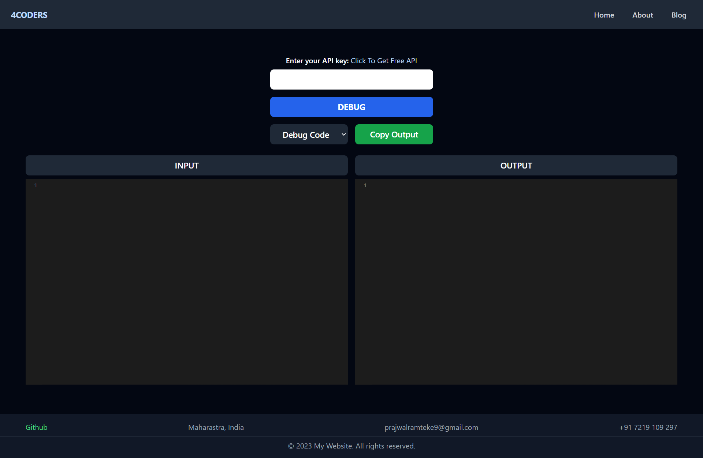

<!-- @format -->

# CodeGPT

CodeGPT is a website that offers a range of services related to coding, such as debugging, code optimization, code enhancement, error reporting, markdown file creation, secure code implementation, code refactoring, and code testing. The website is designed to help developers improve their code, become better at their craft, and ensure that their code is secure and functioning correctly.

# Images

Use 4Coders to Debbuge, Enhance, Optimize, Explain and Writing a code.



## Installation

```sh
git clone https://github.com/PrajsRamteke/4Coders.git
```

Live (click): [CodeGPT](https://GPTcode.netlify.app/).

## Features

- **Debugging:** Users can enter their code and debug it using the website's debugging tool.
- **Optimization:** Users can optimize their code by removing unnecessary lines and improving its performance.
- **Enhancement:** Users can enhance their code by adding comments and making it more readable.
- **Explanation:** Users can request an explanation of code snippets to better understand how they work.
- **Error Reporting:** Users can report errors in code or suggest solutions to fix them.
- **Markdown File:** Users can create documentation for code in a markdown file.
- **Secure Code:** Users can improve the security of existing code.
- **Refactor Code:** Users can reorganize and simplify existing code while maintaining functionality.
- **Test Code:** Users can create tests to verify that code is working correctly.

## Technologies Used

- HTML
- CSS
- JavaScript
- Tailwind CSS
- CodeMirror

## How to Use

- Go to the CodeGPT website.
- Enter your API key or click the "Click To Get Free API" button to get one.
- Enter your code in the "INPUT" section.
- Choose the service you want to use (debugging, optimization, enhancement, or explanation).
- Click the "Debug" button to apply the selected service to your code.
- View the output in the "OUTPUT" section.
- Click the "Copy Output" button to copy the output to your clipboard.

## Credits

- CodeGPT was created by Prajwal Ramteke.
